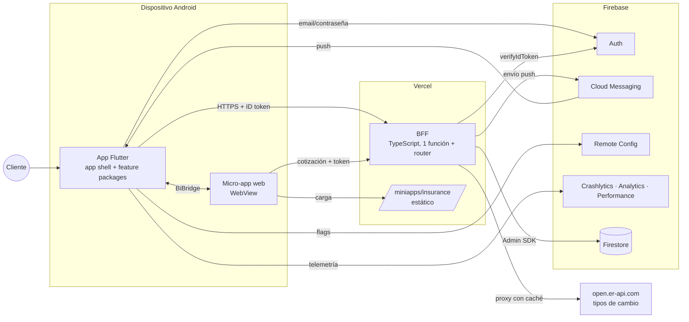
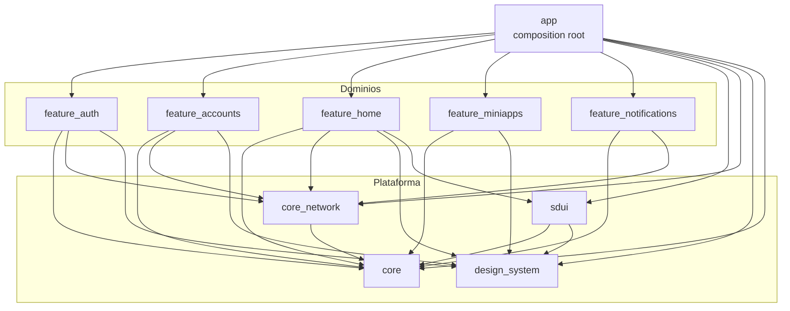
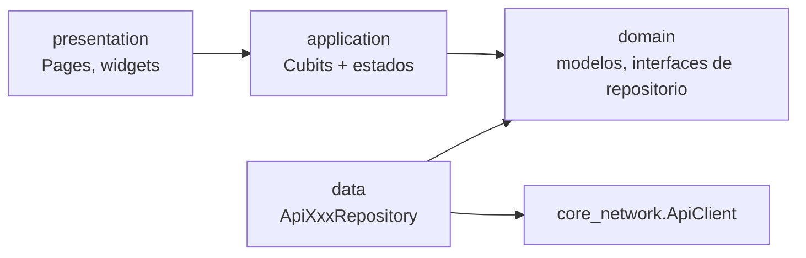
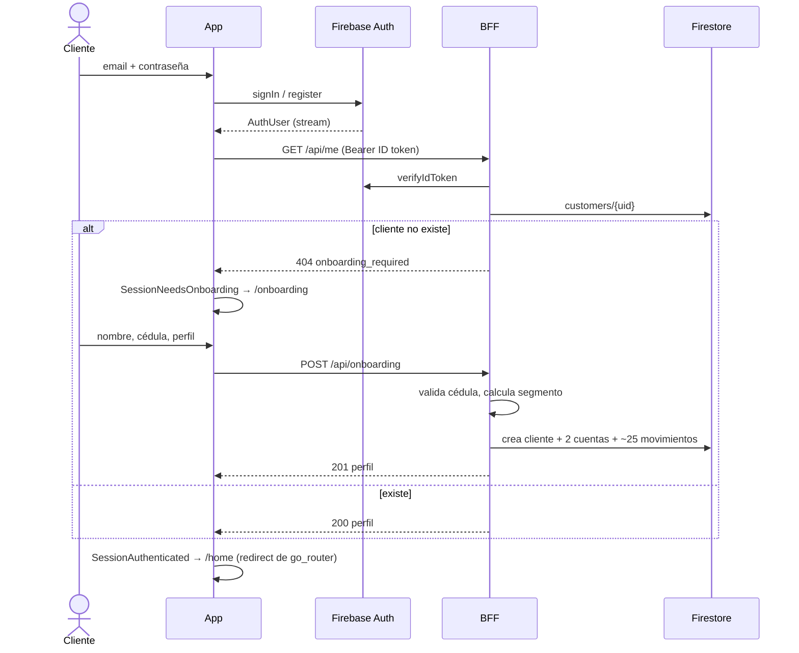
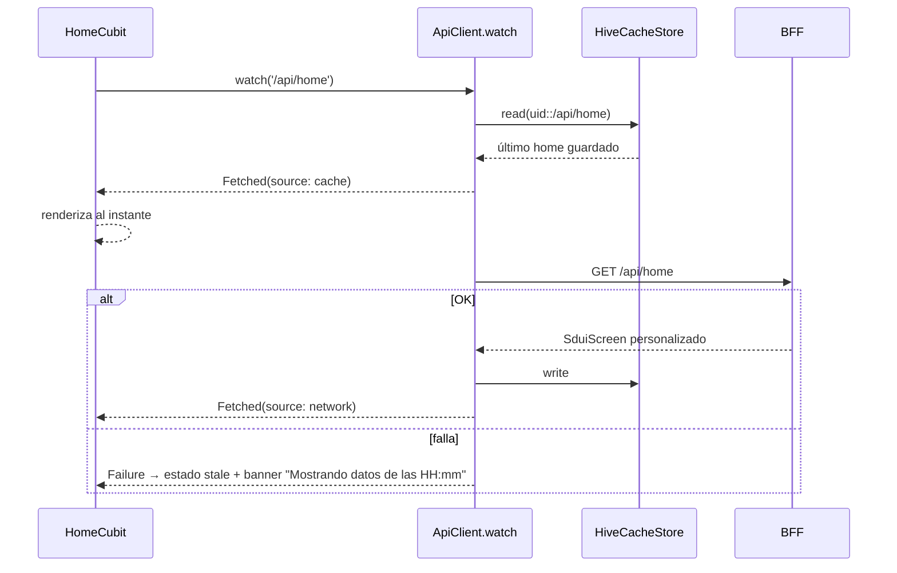
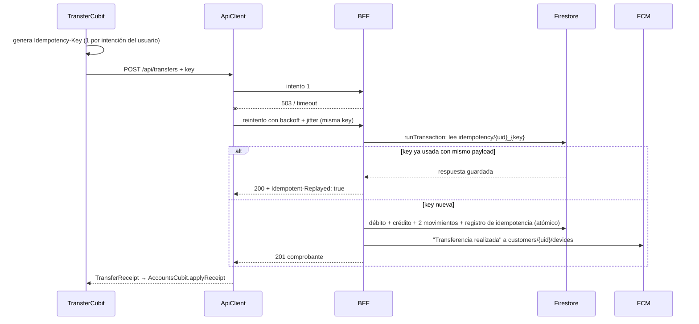
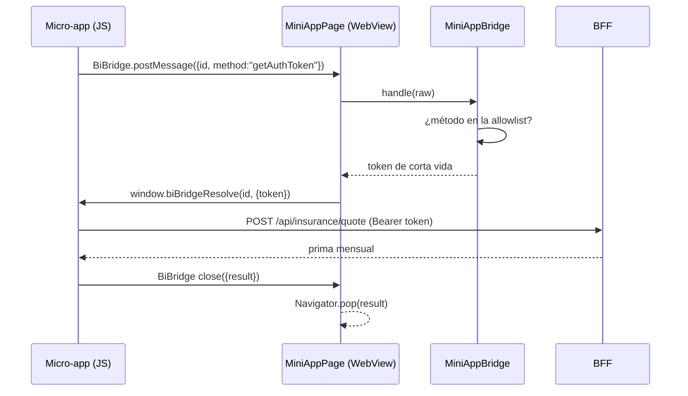
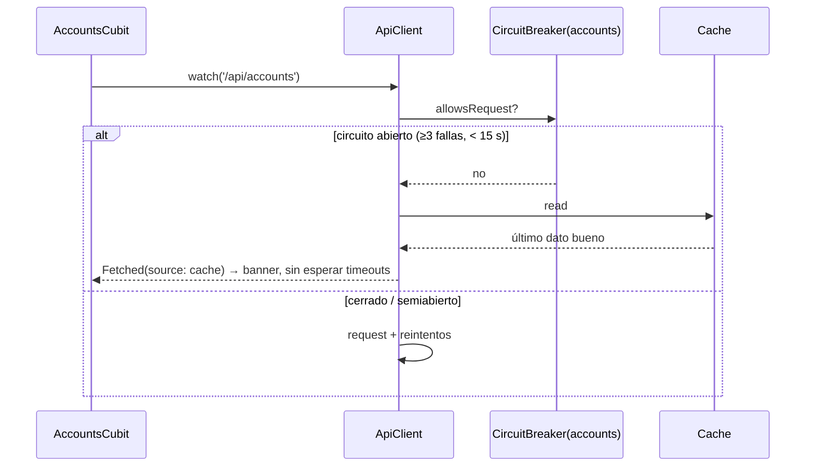

# Arquitectura

Las decisiones con sus alternativas y trade-offs están en [docs/adr](adr/README.md). Este documento describe
cómo encajan las piezas.

## 1. Contexto

Principios:
- **La app nunca toca Firestore.** Las reglas son `deny all` y todo pasa por el BFF, que toma el `uid` del token ([ADR 0003](adr/0003-bff-vercel-firestore.md), [ADR 0006](adr/0006-seguridad.md)).
- Firebase se usa para lo que hace mejor: identidad, push, flags y telemetría.
- El contrato HTTP está en [api-contract.md](api-contract.md). El backend puede cambiar (core bancario, microservicios) sin tocar la app.

## 2. Paquetes y dependencias

Grafo tomado de los `pubspec.yaml` reales:

Regla: **ningún `feature_*` depende de otro.** El único que los conoce a todos es el app shell. Por ejemplo, la sección
`account_summary` de *accounts* aparece en el home de *home* porque el shell la registra en el `SduiRegistry`
(`app/lib/src/pages/home_shell.dart`, `buildSduiRegistry`).

### Capas dentro de un dominio

- `domain` no depende de Flutter ni de HTTP: modelos y contratos (`AccountsRepository`).
- `data` implementa los contratos sobre `ApiClient` y devuelve `Result<T>`, nunca lanza excepciones.
- `application` usa Cubits con estados inmutables que modelan explícitamente "datos en caché + error de refresco" ([ADR 0002](adr/0002-gestion-de-estado-cubit.md)).
- `presentation` recibe dependencias por constructor y navega con callbacks ([ADR 0008](adr/0008-navegacion-y-di.md)).

## 3. Flujos principales

### Login y onboarding

### Home SDUI: caché primero, luego red

### Transferencia idempotente + push

Una key reutilizada con otro payload responde 409 `idempotency_conflict`. El servidor compara un hash de la solicitud
(`backend/src/services/transfers.ts`, `hashTransfer`).

### Llamada del puente de una micro-app

Los métodos fuera de la allowlist (`getContext`, `getAuthToken`, `track`, `notifyHost`, `close`) se rechazan, y la navegación
fuera del origen permitido se bloquea ([ADR 0007](adr/0007-micro-apps-webview-bridge.md)).

### Lectura con un servicio caído

## 4. Motor SDUI

- **Modelo** (`packages/sdui/lib/src/models.dart`): `SduiScreen` → `sections[]` con `id`, `type`, `properties`, `minAppVersion`,
  y acciones selladas `NavigateAction`, `OpenMiniAppAction`, `OpenUrlAction` (solo https) y `UnknownAction`. El parseo es tolerante:
  una sección mal formada se descarta sin tumbar la pantalla.
- **Registro** (`registry.dart`): `type → builder(context, section, onAction)`. Los genéricos se registran con `registerDefaults`
  (greeting, quick_actions, promo_banner, text_card, spending_insight). Los dominios registran los suyos: `fx_rates` desde home y
  `account_summary` desde accounts, vía el shell.
- **Renderer** (`renderer.dart`): omite tipos desconocidos y secciones con `minAppVersion > kSduiVersion` y lo reporta con
  `onSkipped`, que en el shell se convierte en el evento `sdui_section_skipped`. Cada sección va dentro de un *error boundary*:
  si su builder lanza una excepción, se reporta a Crashlytics y el resto de la pantalla sigue funcionando.
- **Servidor** (`backend/src/domain/personalization.ts`): es una función pura (sin I/O) y por eso está cubierta por tests. Calcula:
  - el saludo según la hora de America/Guayaquil;
  - el orden de los accesos rápidos según los eventos `action_used` de los últimos 30 días;
  - el insight de gasto del mes contra el mes anterior, desde los movimientos reales;
  - hasta 3 experiencias de la colección `experiences`, filtradas por segmento, intereses y vigencia, y ordenadas por prioridad.
- **Nuevas experiencias sin release:** basta con un documento nuevo en `experiences` (`backend/scripts/seed-experiences.ts` muestra el formato).

## 5. Supuestos

- Cliente persona natural en Ecuador: cédula válida y USD como moneda única.
- Transferencias sólo entre cuentas propias del cliente. Las interbancarias quedan fuera de alcance: requieren integración SPI/BCE.
- Los saldos y movimientos iniciales se generan en el onboarding (*seed* determinístico). Desde ahí, todo el flujo es real y persistente.
- Android es la plataforma de la demo. El código no tiene nada específico de Android salvo la configuración de Gradle y del manifest.
- El proyecto Firebase está en plan Spark, sin Cloud Functions. Por eso la lógica de servidor vive en Vercel.

## 6. Riesgos técnicos

| Riesgo | Impacto | Mitigación actual | Siguiente paso |
|---|---|---|---|
| Cold start de la función en Vercel | Primera carga lenta | Caché SWR + skeletons; timeouts de 8 s (conexión) y 12 s (respuesta) | Plan con funciones calientes o contenedor siempre activo |
| Límite de 12 funciones (Hobby) | No se podía desplegar un endpoint por función | Un único `api/index.ts` + `src/router.ts`; los handlers siguen siendo un archivo por endpoint | Volver a separar funciones al pasar a Pro o a microservicios |
| Datos en caché desactualizados | El cliente ve un saldo viejo | Siempre se etiquetan con la hora; nunca se usan para validar una transferencia (lo hace el servidor) | TTL máximo de visualización por tipo de dato |
| Caché local sin cifrar | Saldos legibles en un dispositivo comprometido | Separado por `uid` y borrado al cerrar sesión | `HiveAesCipher` con la clave en Keystore ([ADR 0006](adr/0006-seguridad.md)) |
| Micro-app de terceros | Superficie de ataque, UX inconsistente | Allowlist de métodos y de origen, token de corta vida | Token exchange con scopes por micro-app, CSP |
| Esquema SDUI como contrato público | Un cambio incompatible rompe apps viejas | `minAppVersion`, omisión de tipos desconocidos, error boundary | `schemaVersion` por pantalla + tests de contrato |
| Proveedor de tipos de cambio caído | La sección FX falla | Caché de 10 min en el BFF que responde `stale: true`; la sección falla sola, sin afectar el resto | Segundo proveedor como respaldo |
| Dependencia de un único proyecto Firebase | Sin aislamiento entre entornos | — | Un proyecto por entorno ([deployment.md](deployment.md)) |

## 7. Estrategia de escalamiento

- **Más dominios y equipos:** cada dominio nuevo es un paquete con CODEOWNERS y sus propios tests. Los límites los impone el `pubspec`.
  Si un dominio necesita su propio ciclo de release, se extrae a otro repo sin reescribirlo, porque ya tiene API pública.
- **Backend:** hoy el BFF es un monolito modular. El paso natural es un **API Gateway + microservicios por dominio**
  (`/api/accounts` → core bancario, `/api/insurance` → aliado). La app no cambia porque depende del contrato. El circuit breaker por
  servicio en el cliente ya asume que los dominios fallan de forma independiente.
- **Datos y tráfico:** Firestore escala horizontalmente. Las lecturas calientes (home, FX) se pueden cachear en el edge con
  `Cache-Control` por segmento. FX ya tiene caché en memoria por instancia.
- **Multi-región:** Vercel ya sirve desde el edge. Para latencia y residencia de datos se usaría Firestore multirregión o una réplica por región.
- **Releases seguros:** feature flags de Remote Config con rollout por porcentaje, además de staged rollout en Play
  ([deployment.md](deployment.md)).
- **Personalización:** se escala con un backoffice para editar `experiences` con vista previa por segmento y con experimentos A/B
  (el BFF elige la variante y la reporta a analytics).
