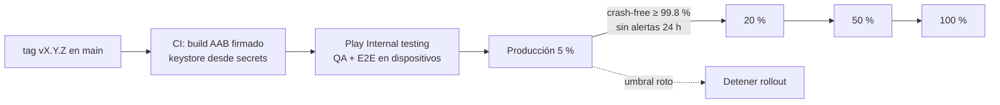

# Estrategia de despliegue

## Entornos

Se compila un binario por entorno a partir del mismo código. La configuración entra en tiempo de build con
`--dart-define` (`app/lib/src/config/env.dart`) y con un proyecto Firebase por entorno.

| Entorno | App | BFF | Firebase | Panel de chaos |
|---|---|---|---|---|
| dev | `--dart-define=APP_ENV=dev --dart-define=BFF_BASE_URL=<preview>` | Vercel *preview* (por PR o rama) | proyecto `-dev` | sí |
| staging | `APP_ENV=staging` | Vercel preview con alias fijo | proyecto `-stg` | sí |
| prod | `APP_ENV=prod --dart-define=ENABLE_CHAOS_PANEL=false` | Vercel production | proyecto `-prod` | **no** |

Hoy existe **un solo** proyecto Firebase (`bi-digital-banking-d0081`) y producción en Vercel. La separación por entornos es la
propuesta. Para aplicarla se repite `flutterfire configure --project=<id> --out=lib/firebase_options_<env>.dart` y se elige el archivo según `APP_ENV`.

## BFF en Vercel

- **Una sola función:** `backend/api/index.ts` delega en `backend/src/router.ts`, un router por tabla (método + regex de ruta).
  El plan Hobby limita cada deploy a **12 funciones** y el BFF tiene 13 endpoints, y por eso se unificaron. `vercel.json` reescribe
  `/api/:path+` → `/api?__path=:path+`, y el router reconstruye la ruta original. Cada endpoint sigue en su propio archivo
  (`backend/src/handlers/*.ts`): volver a separarlos en funciones o servicios es cambiar configuración, no reescribir código.
- **Deploy:** `cd backend && vercel deploy --prod`. Con la integración de Git, cada push a `main` despliega producción y cada PR crea un preview.
- **Variables de entorno** (`backend/.env.example`):

| Variable | Obligatoria | Uso |
|---|---|---|
| `FIREBASE_SERVICE_ACCOUNT` | sí | JSON de la cuenta de servicio en **base64**; inicializa `firebase-admin` |
| `PUBLIC_BASE_URL` | no | Base para las URLs de micro-apps en el SDUI (si falta, se usa el origin de la request) |
| `FX_API_URL` | no | Proveedor de tipos de cambio (por defecto open.er-api.com) |

- **Smoke test** después de cada deploy: `curl https://bi-digital-banking.vercel.app/api/health` debe responder `{"status":"ok"}`.

### Manejo de secretos

- La cuenta de servicio vive **sólo** en las variables cifradas de Vercel. Se carga sin imprimirla en consola:
  `base64 -i key.json | tr -d '\n' | vercel env add FIREBASE_SERVICE_ACCOUNT production`.
- `.gitignore` excluye `.env*`, `service-account*.json` y `.vercel/`.
- `firebase_options.dart` y `google-services.json` **no son secretos**: identifican el proyecto. La protección real está
  en las reglas de Firestore (deny all) y en la verificación del ID token en el BFF. Para producción se agrega App Check.
- Rotación: generar una clave nueva, actualizar la variable, redeploy y revocar la anterior en IAM.

## Firestore

- Reglas versionadas en `backend/firestore.rules` (deny all para clientes). `firebase.json` en la raíz las referencia.
- Deploy: `firebase deploy --only firestore:rules` (proyecto por defecto en `.firebaserc`).
- Datos de negocio iniciales (campañas): `cd backend && FIREBASE_SERVICE_ACCOUNT=... npm run seed:experiences`.

## App móvil

### Hoy

`.github/workflows/ci.yml`, en cada push a `main`:
1. formato + `flutter analyze` + tests unitarios y de widgets con cobertura (resumen lcov en el job);
2. typecheck y tests del BFF;
3. `flutter build apk --release` con `--build-number=${{ github.run_number }}`, publicado como artefacto descargable.

El APK de release se firma con las llaves debug: sirve para la demo, no para la tienda.

### Propuesta de pipeline de release

- Firma: keystore en base64 + contraseñas como *GitHub secrets* que el job decodifica. Nunca va en el repo. Play App Signing guarda la llave final.
- Publicación: Fastlane `supply` (o Codemagic) sube el AAB al track *internal*. La promoción a producción es manual o automática según métricas.
- Gate de cada etapa: tasa de usuarios sin crash en Crashlytics, errores del BFF y SLOs de [operations.md](operations.md).
- iOS: mismo flujo con `match` + TestFlight (fuera del alcance de la demo).

## Estrategia de rollback

| Qué falla | Cómo se revierte | Tiempo |
|---|---|---|
| Una funcionalidad de la app | **Kill switch** en Remote Config (`transfers_enabled`, `miniapps_enabled`) o `maintenance_message` | minutos, sin release |
| Una campaña o el contenido del home | Desactivar el documento en `experiences` (`active: false`) o corregir la composición en el BFF | minutos |
| Un deploy del BFF | **Instant rollback** de Vercel al deploy anterior (`vercel rollback` o el dashboard) | segundos |
| Un release móvil | **Detener el staged rollout** en Play y publicar un hotfix con el build number siguiente. Las apps ya instaladas quedan protegidas por los flags | horas |
| Reglas de Firestore | Redeploy de la versión anterior desde git | minutos |

## Alternativa: contenedor (propuesta)

Los handlers usan la API estándar `Request`/`Response`, así que el mismo router puede correr en un servidor Node propio
(por ejemplo con `@hono/node-server` o un adaptador mínimo) empaquetado en un **Dockerfile**, en un VPS (Vultr), Cloud Run o ECS.
Eso elimina los cold starts y el límite de funciones, a cambio de operar TLS, escalado y parches. **Ese Dockerfile no existe todavía en
el repo**: es el siguiente paso si se necesita desplegar fuera de Vercel.
